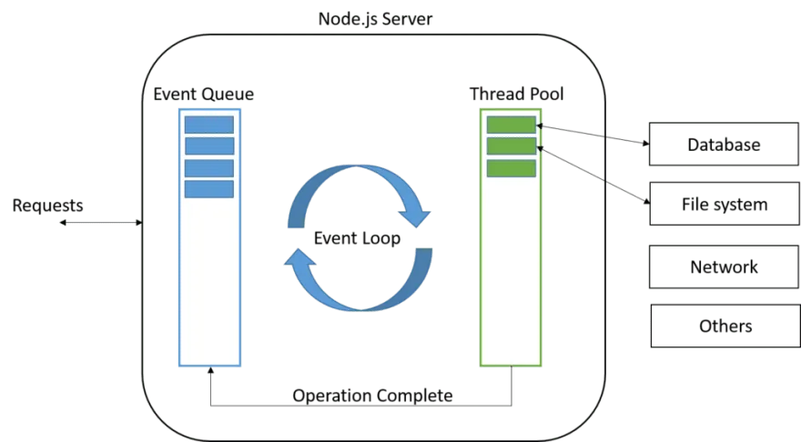

# Какие проблемы решаем?
## Мир до Node.js
### Многопоточный сервер
Веб-приложения, написанные следуя клиент/серверной архитектуре, работают по следующей схеме — клиент запрашивает нужный ресурс у сервера и сервер отправляет ресурс в ответ и прерывает соединение.

Такая модель эффективна поскольку каждый запрос к серверу потребляет ресурсы (память, процессорное время и т.д.). Для того чтобы обрабатывать каждый последующий запрос от клиента, сервер должен завершить обработку предыдущего.

Значит ли это, что сервер может обрабатывать только один запрос за раз? Не совсем! Когда сервер получает новый запрос он создаёт отдельный **поток** для его обработки.

_Поток_, если простыми словами, это время и ресурсы, которые CPU выделяет на выполнение небольшого блока инструкций. Таким образом, сервер может обрабатывать несколько запросов одновременно, но только по одному на поток. Такая модель так же называться `thread-per-request model`.

Для обработки N запросов серверу нужно N потоков. Если сервер получает N+1 запросов, тогда он должен ждать пока один из потоков не станет доступным.
Один из способов справиться с этим — добавить больше ресурсов (памяти, ядер процессора и т. д.) на сервер, но это не самое лучшее решение.

### Блокирующий ввод/вывод
Ограниченное число потоков на сервере не единственная проблема. Один поток не может обрабатывать несколько запросов одновременно из-за `блокирующих операций ввода/вывода`.
Операции ввода-вывода очень медленные, и обычно, поток, обрабатывающий запрос на сервер бездействует ожидая чтения файла с диска, ответа базы данных или какого-то внешнего API.
# Как решаем?
## Node.js
Node.js это серверная платформа, что работает на движке Google Chrome — V8, который умеет компилировать JavaScript код в машинный код.

Node.js использует `событийно-ориентированную` модель и `неблокирующую ввод / вывод`  архитектуру, что делает его легковесным и эффективным. Это не фреймворк, и не библиотека, это среда выполнения JavaScript.

## Non-blocking I/O
Node.js использует неблокирующие ввод/вывод операции и это значит, что:
- Главный поток не будет блокироваться операциями ввода/вывода.
- Сервер будет продолжать обслуживать запросы.
- Нам придётся работать с **асинхронным кодом**.
Например, пока файл считывается с диска, Node.js может обрабатывать другие запросы и даже считывать файл снова и всё это в одном потоке.

# Из чего состоит NodeJS?
## Event loop
`Libuv` — C библиотека которая реализует этот паттерн и является частью ядра Node.js. Вы можете узнать больше о libuv [здесь](https://nikhilm.github.io/uvbook/introduction.html).

Цикл событий — это то, что позволяет Node.js выполнять неблокирующие операции ввода-вывода — несмотря на то, что JavaScript является однопоточным, — по возможности перекладывая операции на ядро системы.

Поскольку большинство современных ядер являются многопоточными, они могут обрабатывать несколько операций, выполняемых в фоновом режиме. Когда одна из этих операций завершается, ядро сообщает Node.js, что соответствующий обратный вызов может быть добавлен в очередь опроса для последующего выполнения. 

Когда Node.js запускается, он инициализирует цикл событий, обрабатывает предоставленный входной сценарий, который может выполнять асинхронные вызовы API, планировать таймеры или вызывать Process.nextTick(), затем начинает обработку цикла событий.

```
     ┌───────────────────┐ 
  ┌─>│ timers            │ 
  │  └────────┬──────────┘
  │  ┌────────┴──────────┐
  │  │ pending callbacks │ 
  │  └────────┬──────────┘ 
  │  ┌────────┴──────────┐ 
  │  │ idle, prepare     │ 
  │  └────────┬──────────┘     ┌───────────────┐ 
  │  ┌────────┴──────────┐     │ incoming:     │ 
  │  │ poll              │<────┤ connections,  │ 
  │  └────────┬──────────┘     │ data, etc.    │ 
  │  ┌────────┴──────────┐     └───────────────┘ 
  │  │ check             │ 
  │  └────────┬──────────┘ 
  │  ┌────────┴──────────┐ 
  └──┤ close callbacks   │
     └───────────────────┘ 
```
Каждый блок будет называться «фазой» цикла событий.

Каждая фаза имеет очередь обратных вызовов FIFO для выполнения. Хотя каждая фаза по-своему особенная, обычно, когда цикл событий входит в данную фазу, он выполняет любые операции, специфичные для этой фазы, а затем выполняет обратные вызовы в очереди этой фазы до тех пор, пока очередь не будет исчерпана или не будет выполнено максимальное количество обратных вызовов. выполнил. Когда очередь исчерпана или достигнут предел обратного вызова, цикл событий перейдет к следующей фазе и так далее.

Поскольку любая из этих операций может планировать дополнительные операции, а новые события, обработанные на этапе опроса, ставятся в очередь ядра, события опроса могут быть поставлены в очередь во время обработки событий опроса. В результате длительные обратные вызовы могут позволить фазе опроса выполняться намного дольше, чем пороговое значение таймера. Более подробную информацию можно найти в разделах таймеров и опросов.

Цикл событий имеет 6 фаз, каждое исполнение всех 6 фаз называют `tick`-ом.

- `timers`: в этой фазе выполняются коллбэки, запланированные методами `setTimeout()` и `setInterval()`;
- `pending callbacks`: выполняются почти все коллбэки, за исключением событий `close`, таймеров и `setImmediate()`;
- `idle, prepare`: используется только для внутренних целей;
- `poll`: ответственен за получение новых событий ввода/вывода. Node.js может блокироваться на этом этапе;
- `check`: коллбэки, вызванные методом `setImmediate()`, выполняються на этом этапе;
- `close callbacks`: например, `socket.on('close', ...)`;

Когда циклу событий нужно выполнить операцию ввода/вывода он использует поток ОС с тредпула (thread pool), а когда задача выполнена, коллбэк ставится в очередь во время фазы  `pending callbacks`.




